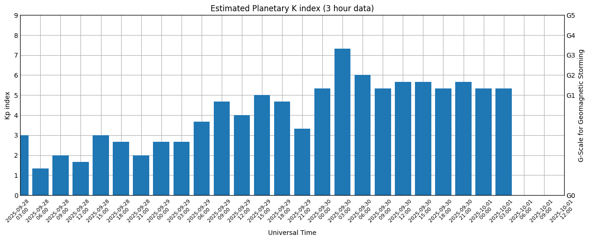

# Space Weather App
## Astronomical Picture of the Day

<br />**Date image released:**  2025-06-02
<br />**This image is owned by:**  
Abdullah Alharbi

<br />**Title of the image:**  Veil Nebula: Wisps of an Ancient Supernova
<br />**Description for the image:**  Wisps like this are all that remain visible of a Milky Way star.  About 7,000 years ago that star exploded in a supernova, leaving the Veil Nebula.  At the time, the expanding cloud was likely as bright as a crescent Moon, remaining visible for weeks to people living at the dawn of recorded history.  Today, the resulting supernova remnant, also known as the Cygnus Loop, has faded and is now visible only through a small telescope directed toward the constellation of the Swan (Cygnus).  The remaining Veil Nebula is physically huge, however, and even though it lies about 1,400 light-years distant, it covers over five times the size of the full Moon.  The featured picture was taken in Kuwait in mid-2024 and features light emitted by hydrogen in red and oxygen in blue.  In deep images of the complete Veil Nebula like this, even studious readers might not be able to identify the iconic filaments.   Piece it All Together: Astronomy Puzzle of the Day
<br />**URL for this image:**  https://apod.nasa.gov/apod/image/2506/VeilWide_Alharbi_5169.jpg

## X-Ray Flux
The GOES X-ray plots shown here are used to track solar activity and solar flares. Large solar X-ray flares can change the Earth’s ionosphere, which blocks high-frequency (HF) radio transmissions on the sunlit side of the Earth. Solar flares are also associated with Coronal Mass Ejections (CMEs) which can ultimately lead to geomagnetic storms. SWPC sends out space weather alerts at the M5 (5x10^-5 Watts/mw) level. Some large flares are accompanied by strong radio bursts that may interfere with other radio frequencies and cause problems for satellite communication and radio navigation (GPS).


### Explanation of R-Scale for Radio Blackouts
Scale | Description | Effect
--- | --- | ---
**R5** | **Extreme** | **HF Radio:** Complete HF (high frequency) radio blackout on the entire sunlit side of the Earth lasting for a number of hours. This results in no HF radio contact with mariners and en route aviators in this sector. **Navigation:** Low-frequency navigation signals used by maritime and general aviation systems experience outages on the sunlit side of the Earth for many hours, causing loss in positioning. Increased satellite navigation errors in positioning for several hours on the sunlit side of Earth, which may spread into the night side.
**R4** | **Severe** | **HF Radio:** HF radio communication blackout on most of the sunlit side of Earth for one to two hours. HF radio contact lost during this time. **Navigation:** Outages of low-frequency navigation signals cause increased error in positioning for one to two hours. Minor disruptions of satellite navigation possible on the sunlit side of Earth.
**R3** | **Strong** | **HF Radio:** Wide area blackout of HF radio communication, loss of radio contact for about an hour on sunlit side of Earth. **Navigation:** Low-frequency navigation signals degraded for about an hour.
**R2** | **Moderate** | **HF Radio:** Limited blackout of HF radio communication on sunlit side, loss of radio contact for tens of minutes. **Navigation:** Degradation of low-frequency navigation signals for tens of minutes.
**R1** | **Minor** | **HF Radio:** Weak or minor degradation of HF radio communication on sunlit side, occasional loss of radio contact. **Navigation:** Low-frequency navigation signals degraded for brief intervals.

## Proton Flux
Proton Event products are issued for several thresholds and for two particle energy levels. The ≥10 MeV products match the NOAA Solar Radiation Storm (S-scale) thresholds (10, 100, 1000, 10000, 100000 pfu), based upon values observed or expected on the primary GOES satellite. The ≥100 MeV products are based on a single flux threshold of 1 proton flux unit (pfu). High-energy particles can reach Earth anywhere from 20 minutes to many hours following the initiating solar event. The particle energy spectrum and arrival time seen by satellites varies with the location and nature of the event on the solar disk.


### Explanation of S-Scale for Solar Radiation Storms
Scale | Description | Effect
--- | --- | ---
**S5** | **Extreme** | **Biological:** Unavoidable high radiation hazard to astronauts on EVA (extra-vehicular activity); passengers and crew in high-flying aircraft at high latitudes may be exposed to radiation risk. **Satellite operations:** Satellites may be rendered useless, memory impacts can cause loss of control, may cause serious noise in image data, star-trackers may be unable to locate sources; permanent damage to solar panels possible. **Other systems:** Complete blackout of HF (high frequency) communications possible through the polar regions, and position errors make navigation operations extremely difficult.
**S4** | **Severe** | **Biological:** Unavoidable radiation hazard to astronauts on EVA; passengers and crew in high-flying aircraft at high latitudes may be exposed to radiation risk. **Satellite operations:** May experience memory device problems and noise on imaging systems; star-tracker problems may cause orientation problems, and solar panel efficiency can be degraded. **Other systems:** Blackout of HF radio communications through the polar regions and increased navigation errors over several days are likely.
**S3** | **Strong** | **Biological:** Radiation hazard avoidance recommended for astronauts on EVA; passengers and crew in high-flying aircraft at high latitudes may be exposed to radiation risk. **Satellite operations:** Single-event upsets, noise in imaging systems, and slight reduction of efficiency in solar panel are likely. **Other systems:** Degraded HF radio propagation through the polar regions and navigation position errors likely.
**S2** | **Moderate** | **Biological:** Passengers and crew in high-flying aircraft at high latitudes may be exposed to elevated radiation risk. **Satellite operations:** Infrequent single-event upsets possible. **Other systems:** Small effects on HF propagation through the polar regions and navigation at polar cap locations possibly affected.
**S1** | **Minor** | **Biological:** None. **Satellite operations:** None. **Other systems:** Minor impacts on HF radio in the polar regions.

## Planetary K-Index
The K-index, and by extension the Planetary K-index, are used to characterize the magnitude of geomagnetic storms. Kp is an excellent indicator of disturbances in the Earth's magnetic field and is used by SWPC to decide whether geomagnetic alerts and warnings need to be issued for users who are affected by these disturbances. The principal users affected by geomagnetic storms are the electrical power grid, spacecraft operations, users of radio signals that reflect off of or pass through the ionosphere, and observers of the aurora.


### Explanation of G-Scale for Geomagnetic Storming
Scale | Description | Effect
--- | --- | ---
**G5** | **Extreme** | **Power systems:** Widespread voltage control problems and protective system problems can occur, some grid systems may experience complete collapse or blackouts. Transformers may experience damage. **Spacecraft operations:** May experience extensive surface charging, problems with orientation, uplink/downlink and tracking satellites. **Other systems:** Pipeline currents can reach hundreds of amps, HF (high frequency) radio propagation may be impossible in many areas for one to two days, satellite navigation may be degraded for days, low-frequency radio navigation can be out for hours, and aurora has been seen as low as Florida and southern Texas (typically 40° geomagnetic lat.).
**G4** | **Severe** | **Power systems:** Possible widespread voltage control problems and some protective systems will mistakenly trip out key assets from the grid. **Spacecraft operations:** May experience surface charging and tracking problems, corrections may be needed for orientation problems. **Other systems:** Induced pipeline currents affect preventive measures, HF radio propagation sporadic, satellite navigation degraded for hours, low-frequency radio navigation disrupted, and aurora has been seen as low as Alabama and northern California (typically 45° geomagnetic lat.).
**G3** | **Strong** | **Power systems:** Voltage corrections may be required, false alarms triggered on some protection devices. **Spacecraft operations:** Surface charging may occur on satellite components, drag may increase on low-Earth-orbit satellites, and corrections may be needed for orientation problems. **Other systems:** Intermittent satellite navigation and low-frequency radio navigation problems may occur, HF radio may be intermittent, and aurora has been seen as low as Illinois and Oregon (typically 50° geomagnetic lat.).
**G2** | **Moderate** | **Power systems:** High-latitude power systems may experience voltage alarms, long-duration storms may cause transformer damage. **Spacecraft operations:** Corrective actions to orientation may be required by ground control; possible changes in drag affect orbit predictions. **Other systems:** HF radio propagation can fade at higher latitudes, and aurora has been seen as low as New York and Idaho (typically 55° geomagnetic lat.).
**G1** | **Minor** | **Power systems:** Weak power grid fluctuations can occur. **Spacecraft operations:** Minor impact on satellite operations possible. **Other systems:** Migratory animals are affected at this and higher levels; aurora is commonly visible at high latitudes (northern Michigan and Maine).

## 3-day Forecast
```
:Product: 3-Day Forecast
:Issued: 2025 Jun 02 0030 UTC
# Prepared by the U.S. Dept. of Commerce, NOAA, Space Weather Prediction Center
#
A. NOAA Geomagnetic Activity Observation and Forecast

The greatest observed 3 hr Kp over the past 24 hours was 8 (NOAA Scale
G4).
The greatest expected 3 hr Kp for Jun 02-Jun 04 2025 is 7.67 (NOAA Scale
G4).

NOAA Kp index breakdown Jun 02-Jun 04 2025

             Jun 02       Jun 03       Jun 04
00-03UT       7.00 (G3)    4.33         4.00     
03-06UT       7.67 (G4)    5.00 (G1)    4.00     
06-09UT       6.67 (G3)    4.67 (G1)    3.33     
09-12UT       6.33 (G2)    4.67 (G1)    3.00     
12-15UT       5.00 (G1)    4.67 (G1)    3.00     
15-18UT       4.67 (G1)    4.33         3.33     
18-21UT       5.33 (G1)    4.00         3.00     
21-00UT       4.33         4.00         2.67     

Rationale: UP to G4 (Severe) geomagnetic storms are likely on 02 Jun
due to effects from a CME that left the Sun on 31 May. G1-G2
(Minor-Moderate) geomagnetic storms are likely on 03 Jun due to coronal
hole influence.

B. NOAA Solar Radiation Activity Observation and Forecast

Solar radiation, as observed by NOAA GOES-18 over the past 24 hours, was
above S-scale storm level thresholds.

Solar Radiation Storm Forecast for Jun 02-Jun 04 2025

              Jun 02  Jun 03  Jun 04
S1 or greater   99%     75%     60%

Rationale: S1-S2 (Minor-Moderate) solar radiation storms are likely
persist over 02-03 Jun becoming likely on 04 Jun.

C. NOAA Radio Blackout Activity and Forecast

No radio blackouts were observed over the past 24 hours.

Radio Blackout Forecast for Jun 02-Jun 04 2025

              Jun 02        Jun 03        Jun 04
R1-R2           65%           65%           65%
R3 or greater   15%           15%           15%

Rationale: R1-R2 (Minor-Moderate) radio blackouts are likely, with a
slight chance for R3 (Strong), over 02-04 Jun.

```